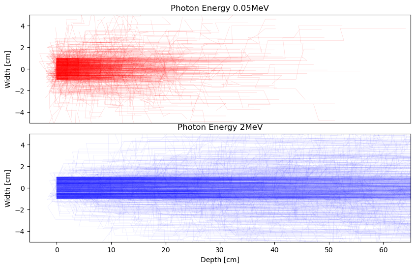
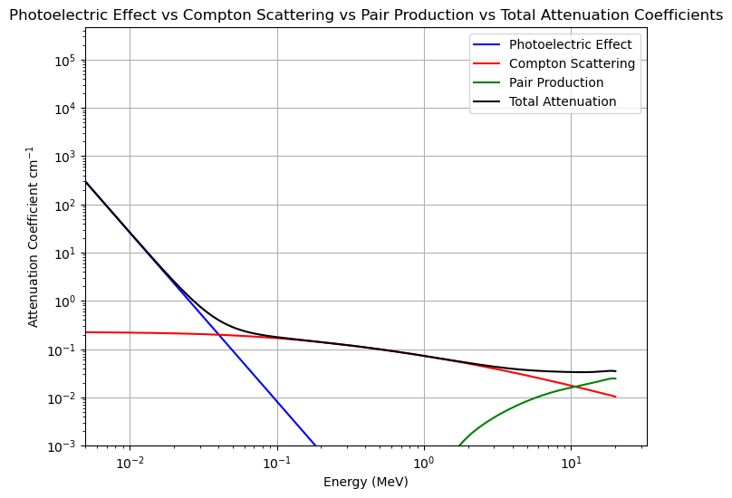

# Monte Carlo: Modelling Photon Paths in Water

### Introduction
The presented Python code utilises Monte Carlo simulations to model the trajectories of photons interacting with water based on their energy. Monte Carlo methods are powerful tools in physics for stochastic modelling, and in this context, they are applied to emulate the intricate interactions between photons and water. The simulation accounts for various interaction processes such as Compton scattering, the photoelectric effect, and pair production, which collectively contribute to the attenuation of photons in the travelling medium.

  

### For Whom Is This Repository Targeted?

<br\>
This repository serves as a comprehensive resource designed to provide insight into the intricate interactions between photons and matter, along with an introduction to the principles of Monte Carlo simulations. 
<br\>
Detailed description of photon interactions such as photoelectric effect, Compton scattering, and pair production can be found as well as how to simulate them. Additionally, this repository serves as a great introduction to Monte Carlo modelling. Monte Carlo experimentation is the use of simulated random numbers to estimate some functions of a probability distribution. Techniques such as Inverse Function and Accept/Reject methods are illustrated in this repository.

This repository serves as a comprehensive resource designed to provide insight into the intricate interactions between photons and matter, along with an introduction to the principles of Monte Carlo simulations. Tailored for both students and professors, the content aims to facilitate a profound understanding of these phenomena and simulation techniques. Whether you're an aspiring learner or an educator seeking illustrative materials for classroom use, this repository offers valuable insights and practical examples.
