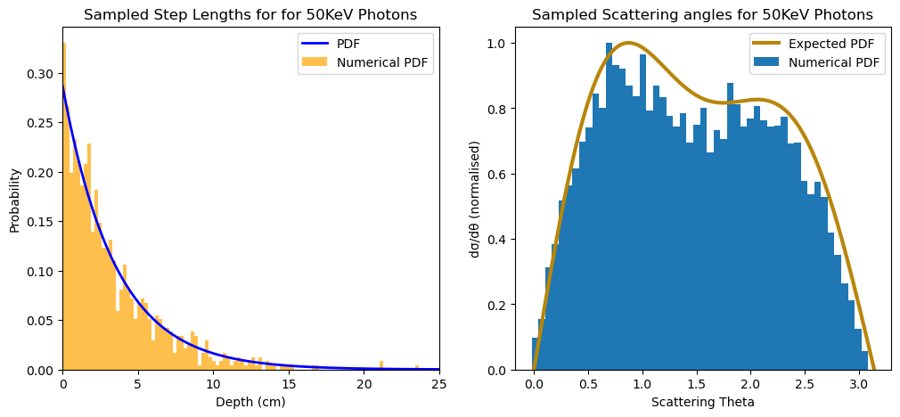
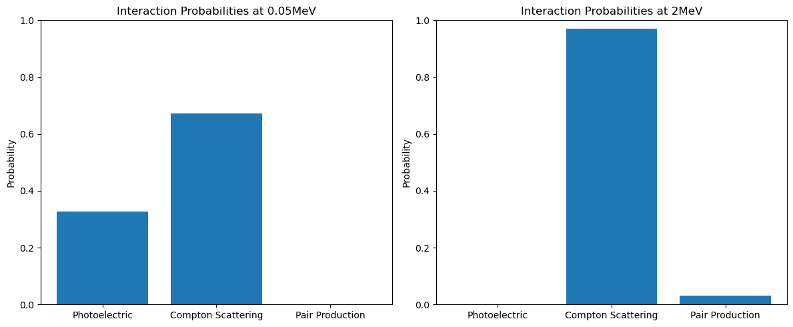

# Monte Carlo: Modelling Photon Paths in Water

## Introduction
The presented Python code utilises Monte Carlo simulations to model the trajectories of photons interacting with water based on their energy. Monte Carlo methods are powerful tools in physics for stochastic modelling, and in this context, they are applied to emulate the intricate interactions between photons and water. The simulation accounts for various interaction processes such as Compton scattering, the photoelectric effect, and pair production, which collectively contribute to the attenuation of photons in the travelling medium.
 
The code is organised into distinct sections, covering simulated photon energies, photon interactions, attenuation mechanisms, interaction probabilities, scattered photon energy calculations, Compton scattering angle sampling and the simulation of photon paths in a medium.

  

## For Whom Is This Repository Targeted?

<br\>
This repository serves as a comprehensive resource designed to provide insight into the intricate interactions between photons and matter, along with an introduction to the principles of Monte Carlo simulations. 
 
Explore in-depth insights into photon interactions, including discussions on the photoelectric effect, Compton scattering, and pair production, accompanied by practical guidance on their simulation techniques. Additionally, this repository serves as a great introduction to Monte Carlo modelling. Monte Carlo experimentation is the use of simulated random numbers to estimate some functions of a probability distribution. Techniques such as Inverse Function and Accept/Reject methods are illustrated in this repository.
 
This repository serves as a comprehensive resource designed to provide insight into the intricate interactions between photons and matter, along with an introduction to the principles of Monte Carlo simulations. Tailored for both students and professors, the content aims to facilitate a profound understanding of these phenomena and simulation techniques. Whether you're an aspiring learner or an educator seeking illustrative materials for classroom use, this repository offers valuable insights and practical examples.
 
 

  

## Usage Instructions

1. **Download and Run the Jupyter Notebook**
   - Download the provided Jupyter Notebook file (`.ipynb`).
   - Run the notebook using a Jupyter Notebook environment.

2. **Simulated Photon Energies**
   - The simulation focuses on two photon energies: 50 keV and 2 MeV.
   - Customize photon energies directly in the code (see section 0)

3. **Execute the Simulation**
   - Run the entire Jupyter Notebook to perform the simulation.
   - Observe detailed insights into photon interactions, paths, and energy changes.

4. **Explore and Analyse**
   - Analyse visualisations, graphs, and data in the notebook.
   - Compare photon paths and interactions at different energy levels.

5. **Modify Parameters (Optional)**
   - Experiment with parameters like the number of simulated photons, cutoff energy, and step length.
   - Gain deeper insights into photon behaviour in the simulated environment.
   - Gain greater understanding of Monte Carlo simulation techniques.

Feel free to interact with the code, experiment with parameters, and enhance your understanding of photon interactions through Monte Carlo simulations.

## License 
This project is provided under the MIT License. You are welcome to use, modify, and distribute the codes presented in the repository under the terms of the MIT License. Please refer to the "LICENSE" file and the accompanying license documentation for full details.

## Future Improvements
We welcome contributions, suggestions, and ideas for future improvements. If you have any insights, additional features, or enhancements you'd like to see, feel free to contribute. Create pull requests or open issues on the GitHub repository to share your thoughts and collaborate on making this resource even better.

## Contact
If you have any questions, suggestions, or need assistance, please do not hesitate to contact us at [kyriakosfotiou1@gmail.com](mailto:kyriakosfotiou1@gmail.com).

